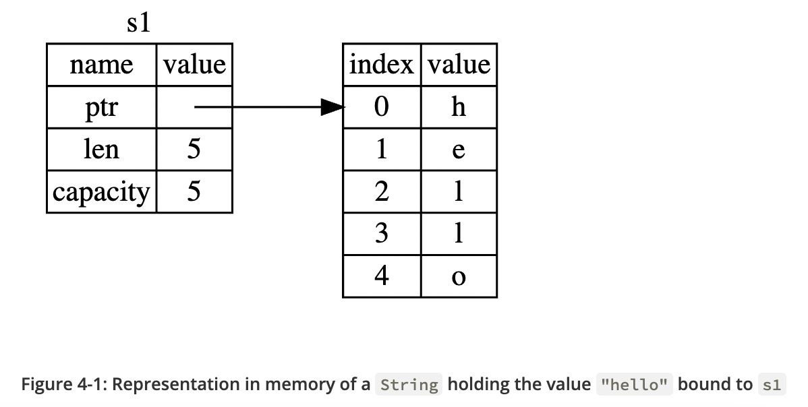
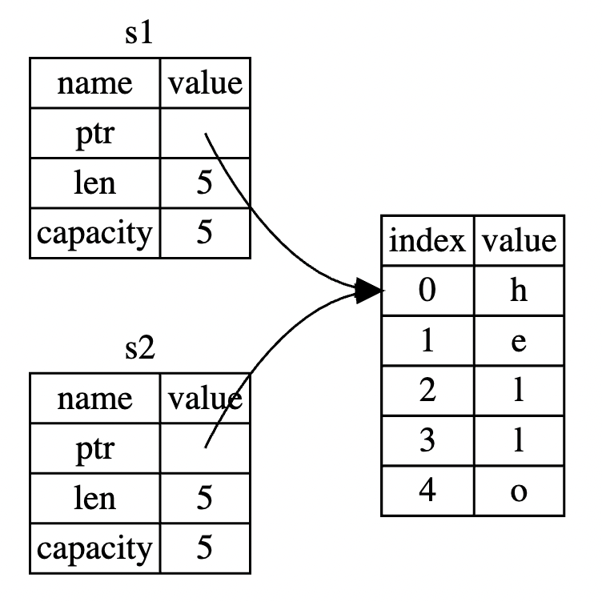
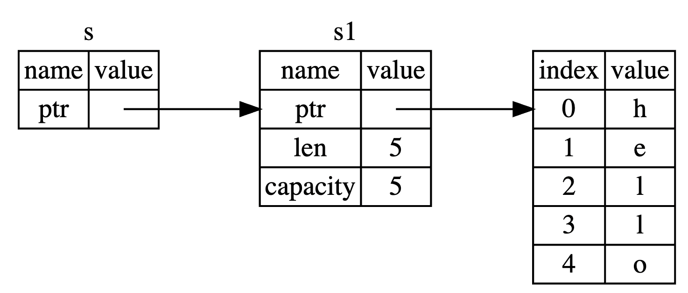

# Getting started

## Hello, World!

To compile and run a .rs file:
```
rustc main.rs
./main
```
The `main` function is special: it is always the first code that runs in every executable Rust program.
Rust style is to indent with four spaces, not a tab.
`println!` calls a Rust macro. If it called a function instead, it would be entered as `println`.
Most lines of Rust code end with a semicolon.

Rust is an ahead-of-time compiled language, meaning you can compile a program and give the executable to someone else, 
and they can run it even without having Rust installed.
If you give someone a .rb, .py, or .js file, they need to have a Ruby, Python, or JavaScript implementation installed.
But in those languages, you only need one command to compile and run your program.

## Hello, Cargo!

Create a project with Cargo:
```
cargo new my_app
```

The *Cargo.toml* file is Cargo's configuration file.
The last line, `[dependencies]`, is the start of a section for you to list nay of your project's dependencies.
In Rust, packages of code are referred to as *crates*.

Cargo expects your source files to live inside the *src* directory.
The top-level project directory is just for README files, license information, configuration files, and anything else not related to your code.

Build your project:
```
cargo build
```
This command creates an executable file in *target/debug/hello_cargo* rather than in your current directory.
You can run this executable with:
```
./target/debug/hello_cargo
```

Running `cargo build` for the first time also causes Cargo to create a new file at the top level: *Cargo.lock*.
This file keeps track of the exact versions of dependencies in your project.
You won't ever need to change this file manually; Cargo manages its contents for you.

We can also use `cargo run` to compile the code and then run the resulting executable all in one command.

Cargo also provides a command called `cargo check`.
This command quickly checks your code to make sure it compiles but doesn't produce an executable.
`cargo check` is much faster than `cargo build`, because it skips the step of producing an executable.

When your project is finally ready for release, you can use `cargo build --release` to compile it with optimizations.
This command will create an executable in *target/release* instead of *target/debug*.
The optimizations make your Rust code run faster, but turning them on lengthens the time it takes for your program to compile.
If you're benchmarking hour code's running time, be sure to run `cargo build --release` and benchmark with the executable in *target/release*.

# Guessing Game

```rust
use std::io;
use rand::Rng;
use std::cmp::Ordering;

fn main() {
    println!("Guess the number!");

    let secret_number = rand::thread_rng().gen_range(1, 101);

    loop {
        println!("Please input your guess.");

        let mut guess = String::new();
        io::stdin()
            .read_line(&mut guess)
            .expect("Failed to give an input!");
        let guess: u32 = match guess.trim().parse() {
            Ok(num) => num,
            Err(_) => continue,
        };

        match guess.cmp(&secret_number) {
            Ordering::Less => println!("Too small!"),
            Ordering::Greater => println!("Too big!"),
            Ordering::Equal => {
                println!("You win!");
                break;
            }
        };
    }
}

```

To obtain user input and then print the result as output, we need to bring the `io` (input/output) library into scope.
```
use std::io;
```

## Storing Values with Variables

`let` statement is used to create a *variable*.
In Rust, variables are immutable by default.
Use `mut` before the variable name to make a variable mutable.

`String` is a string type provided by the standard library that is a growable, UTF-8 encoded bit of text.
The `::` syntax in the `::new` line indicates that `new` is an *associated function* of the `String` type.
An associated function is implemented on a type, in this case `String`, rather than on a particular instance of a `String`.
Some languages call this a static method.

Call the `stdin` function from the `io` module:
```
io::stdin()
    .read_line(&mut guess);
```
The `&` indicates that this argument is a *reference*, which gives you a way to let multiple parts of your code access one piece of data without needing to copy that data into memory multiple times.
References are a complex feature, and one of Rust's major advantages is how safe and easu it is to use references.
References are immutable by default. Hence, you need to write `&mut guess` rather than `&guess` to make it mutable.

When you call a method with the `.foo()` syntax, it's often wise to introduce a newline and other whitespace to help break up long lines.

The `Result` types are *enumerations*, often referred to as *enums*.
An enumeration is a type that can have a fixed set of values, and those values are called the enum's variants.

For `Result`, the variants are `Ok` or `Err`.
The `Ok` variant indicates the operation was successful, and inside `Ok` is the successfully generated value.
The `Err` variant means the operation failed, and `Err` contains information about how or why the operation failed.

An instance of `io::Result` has an `expect` method that you can call.
If this instance of `io::Result` is an `Err` value, `expect` will cause the program to crash and display the message that you passed as an argument to `expect`.
If this instance of `io::Result` is an `Ok` value, `expect` will take the return value that `Ok` is holding and return just that value to you so you can use it.

## Using a Crate to Get More Functionality

Remember that a crate is a collection of Rust source code files.
The project we've been building is a *binary crate*, which is an executable.
The `rand` crate is a *library crate*, which contains code intended to be used in other programs.

Before we can write code that uses `rand`, we need to modify the *Cargo.toml* file to include the `rand` rate as a dependency.

Now that we have an external dependency, Cargo fetches the latest versions of everything from the *registry*,
which is a copy of data from Crates.io. Crates.io is where people in the Rust ecosystem post their open source Rust projects for others to use.

Cargo has a mechanism that ensures you can rebuild the same artifact every time you or anyone else builds your code: 
Cargo will use only the versions of the dependencies you specified until you indicate otherwise.
When you build a project for the first time, Cargo figures out all the versions of the dependencies that fit the criteria 
and then writes them to the *Cargo.lock* file.
When you build your project in the future, Cargo will see that the *Cargo.lock* file exists and use the versions specified there rather than doing all the work of figuring out versions again.

When you do want to update a crate, Cargo provides another command, `update`, which will ignore the *Cargo.lock* file
and figure out all the latest versions that fit you specifications in *Cargo.toml*.
If that works, Cargo will write those versions to the *Cargo.lock* file.

Another neat feature of Cargo is that you can run the `cargo doc --open` command, 
which will build documentation provided by all of your dependencies locally and open it in your browser.

A `match` expression is made up of *arms*.
An arm consists of a *pattern* and the code that should be run if the value given to the beginning of the `match` expression fits that arms' pattern.
The `match` construct and patterns are powerful features in Rust that let you express a variety of situations your code might encounter and make sure that you handle them all.

Rust has a strong, static type system.
However, it also has type inference.
Rust allows us to *shadow* the previous value of `guess` with a new one.
This feature is often used in situations in which you want to convert a value from one type to another type.
Shadowing lets us reuse the `guess` variable name rather than forcing us to create two unique variables.

`u32` is a good default choice for a small positive number.

Switching from an `expect` call to a `match` expression is how you generally move from crashing on an error to handling the error.

# Common Programming Concepts

## Variables and Mutability

In Rust, the compiler guarantees that when you state that a value won't change, 
it really won't change.
That means that when you're reading and writing code, you don't have to keep track of how and where a value might change.
Your code is thus easier to reason through.

You aren't allowed to use `mut` with constants.
Constants aren't just immutable by default -- they're always immutable.

You declare constants using the `const` keyword instead of `let`, and the type of the value *must* be annotated.
Constants can be declared in any scope, including the global scope, which makes them useful for values that many parts of code need to know about.

The last difference is that constants may be set only to a constant expression,
not the result of a function call or any other value that could only be computed at runtime.

Constants are valid for the entire time a program runs, within the scope they were declared in,
making them a useful choice for values in your application domain that multiple parts of the program might need to know about.

### Shadowing
We can shadow a variable by using the same variable's name and repeating the use of `let` keyword as follows:
```rust
fn main() {
    let x = 5;
    let x = x + 1;
    let x = x * 2;
    println!("{}", x);
}
```

Shadowing is different from making the variable `mut`, because we'll get a compile-time error if we accidentally try to reassign to this variable without using `let`.
By using `let`, we can perform a few transformation on a value but have the variable be immutable after those transformations have been completed.

The other difference between `mut` and shadowing is that because we're effectively creating a new variable when we use the `let` keyword again,
we can change the type of the variable but reuse the same name.

## Data Types
Keep in mind that Rust is a statically typed language, which means it must know the types of all variables at compile time.

### Scalar Types
A *scalar* type represents a single value.
Rust has four primary scalar types: integers, floating-point, numbers, Booleans, and characters.

#### Integer Types
`u32` -- unsigned integer that takes up 32 bits of space.

Each variant can be either signed or unsigned and has an explicit size.

Additionally, the `isize` and `usize` types depend on the kind of computer your program is running on:
64 bits if you're on a 64-bit architecture and 32 bits if you're on a 32-bit architecture.

Rust's defaults are generally good choices, and integer types default to `i32`:
this type is generally the fastest, even on 64-bit systems.

#### Floating-Point Types
Rust's floating-point types are `f32` and `f64`, which are 32 bits and 64 bits in size, respectively.
The default if `f64` because on modern CPUs it's roughly the same speed as `f32` but is capable of more precision.

#### The Boolean Type
The Boolean type in Rust has two possible values: `true` and `false`.
Booleans are one byte in size.

#### Character Types
Rust's `char` type is four bytes in size and represents a Unicode Scalar Value.

### Compound Types
*Compound types* can group multiple values into one type.
Rust has two primitive compound types: tuples and arrays.

#### The Tuple Type
In `()`.

A tuple is a general way of grouping together a number of values with a variety of types into one compound type.
Tuples have a fixed length: once declared, they cannot grow or shrink in size.

Each position in the tuple has a type, and the types of the different values in the tuple don't have to be the same.

To get the individual values out of a tuple, we can use pattern matching to destructure a tuple value, like:
```rust
fn main() {
    let tup: (i32, f64, u8) = (500, 6.4, 1);
    let (x, y, z) = tup;
    println!("The value of y is {}", y);
}
```

In addition to destructuring through pattern matching, we can access a tuple element directly by using a period(`.`) followed by the index of the value we want to access:

#### The Array Type
In `[]`.

Unlike a tuple, every element of an array must have the same type.
Arrays in Rust also have a fixed length, like tuples.

Arrays are useful when you want your data allocated on the stack rather than the heap or when you want to ensure you always have a fixed number of elements.

If you're unsure whether to use an array or a vector (provided by the standard library), you should probably use a vector.

You would write an array's type by using square brackets, and within the brackets include the type of each element, a semicolon, 
and then the number of elements in the array:
```rust
fn main() {
    let a: [i32; 5] = [1, 2, 3, 4, 5];
    let b = [3; 5];     // [value for all elements; size]
}
```

You can access elements of an array using indexing:
```rust
fn main() {
    let a = [1, 2, 3, 4, 5];
    let first = a[0];
    let second = a[1];
}
```

When you attempt to access an element using indexing, Rust will check that the index you've specified is less than the array length.
If the index is greater than or equal to the array length, Rust will panic.
In many low-level language, this kind of check is not done, and when you provide an incorrect index, invalid memory can be accessed.
Rust protects you against this kind of error by immediately exiting instead of allowing the memory access and continuing.

## Functions
Rust code uses *snake case* as the conventional style for function and variable names.
In snake case, all letters are lowercase and underscores separate words.

Rust doesn't care where you define your functions, only that they're defined somewhere.

In function signatures, you must declare the type of each parameter.
This is a deliberate decision in Rust's design: requiring type annotations in function definitions means the compiler almost never needs you to use them elsewhere in the code to figure out what you mean.

### Function Bodies Contain Statements and Expressions

Rust is an expression-based language. *Statements* are instructions that perform some action and do not return a value.
*Expressions* evaluate to a resulting value.

Statements do not return values.
Therefore, you can't assign a `let` statement to another variable; you'll get an error:
```rust
fn main() {
    let x = (let x = 6);
}
```
This is different from what happened in other languages, such as C and Ruby, where the assignment returns the value of the assignment.

Expressions evaluate to something and make up most of the rest of the code that you'll write in Rust.
Consider a simple math operation, such as `5 + 6`, which is an expression that evaluates to the value `11`.
Calling a function is an expression. Calling a macro is an expression.
The block `{}` we use to create new scopes, is an expression.
```rust
fn main() {
    let x = 5;
    let y = {
        let x = 3;
        x + 1
    };
    println!("The value of y is {}", y);
}
```
Expressions do not include ending semicolons.
If you add a semicolon to the end of an expression, you turn it into a statement, which will then not return a value.

### Functions with Return Values
We don't name return values, but we do declare their type after an arrow(`->`).

In Rust, the return value of the function is synonymous with the value of the final expression in the block of the body of a function.
You can return early from a function by using the `return` keyword and specifying a value, ut most functions return the last expression implicitly.
```rust
fn main() {
    let x = five();
    println!("The value of x is {}", x);
}

fn five() -> i32 {
    5
}
```

## Control Flow
Blocks of code associated with the conditions in `if` expression are sometimes called *arms*, just like `match`.

It's also worth noting that the condition must be `bool`.
If the condition is not a `bool`, we'll get an error.

Because `if` is an expression, we can use it on the right side of a `let` statement:
```rust
fn main() {
    let condition = true;
    let number = if condition {5} else {6};
}
```
Blocks of code evaluate to the last expression in them, and numbers by themselves are also expressions.
The `if` and `else` must have the same value type.
```rust
fn main() {
    let condition = true;
    let number = if condition {5} else {"six"};
}
```
This will not work because variables must have a single type.
Rust needs to know at compile time what type the `number` variable is, definitely, so it can verify at compile time that its type is valid everywhere we use `number`.

### Repeating Code with `loop`
The `loop` keyword tells Rust to execute a block of code over and over again forever or until you explicitly tell it to stop.

You can place the `break` keyword within the loop to tell the program when to stop executing the loop.

One of the uses of a `loop` is to retry an operation you know might fail, such as checking whether a thread has completed its job.
You might need to pass the result of that operation to the rest of your code.
To do this, you can add the value you want returned after the `break` expression you use to stop the loop;
that value will be returned out of the loop so you can use it:
```rust
fn main() {
    let mut counter = 0;
    let result = loop {
        counter += 1;
        if counter == 10 {
            break counter * 2;
        }
    };
    println!("{}", result);
}
```

As a more concise alternative, you can use a `for` loop and execute some code for eqch item in a collection.
```rust
fn main() {
    let a = [10, 20, 30, 40, 50];
    for element in a.iter() {
        println!("{}", element);
    }
}
```
We have now increased the safety of the code and eliminated the chance of bugs that might result from going beyond the end of the array or not going far enough and missing some items.

The safety and conciseness of `for` loops make them the most commonly used loop construct in Rust.

# Understanding Ownership

## What is *Ownership*?
Rust's central feature is *ownership*.

All programs have to manage the way they use a computer's memory while running.
Some languages have garbage collection that constantly looks for non longer used memory as the program run;
in other languages, the programmer must explicitly allocate and free the memory.

Rust uses a third approach: memory is managed through a system of ownership with a set of rules that the compiler checks at compile time.

### The Stack and the Heap
In a systems programming language behaves and why you have to make certain decisions.

The stack stores values in the order it gets them and removes the values in the opposite order.

All data stored on the stack must have a known, fixed size.
Data with an unknown size at compile time or a size that might change must be stored on the heap instead.
The heap is less organized: when you put data on the heap, you request a certain amount of space.
The memory allocator finds an empty spot in the heap that is big enough, marks it as being in use,
and returns a *pointer*, which is the address of that location.

Pushing to the stack is faster than allocating on the heap because the allocator never has to search for a place to store new data;
that location is always at the top of the stack.
Comparatively, allocating space on the heap requires more work, because the allocator must first find a big enough space to hold the data and then perform bookkeeping to prepare for the next allocation.

Accessing data in the heap is slower than accessing data on the stack because you have to follow a pointer to get there.

When your code calls a function, the values passed into the function (including, potentially, pointers to data on the heap)
and the function's local variables get pushed onto the stack.
When the function is over, those values get popped off the stack.

Keeping track of what parts of code are using what data on the heap, minimizing the amount of duplicate data on the heap, and cleaning up unused data on the heap so you don't run out of space are all problems that ownership addresses.

### Ownership Rules
- Each value in Rust has a variable that's called its *owner*.
- There can only be one owner at a time.
- When the owner goes out of scope, the value will be dropped.

### The `String` Type
String literals are convenient, but they aren't suitable for every situation in which we may want to use text.
One reason is that they're immutable.
Another is that not every string value can be known when we write our code.

Rust has a second string type, `String`.
This type is allocated on the heap and as such is able to store an amount of text that is unknown to us at compile time.
```rust
fn main() {
    let s = String::from("hello");
}
```

This kind of *string* can be mutated.
```rust
fn main() {
    let mut s = String::from("hello");
    s.push_str(", world!");
    println!("{}", s);
}
```

In the case of a string literal, we know the contents at compile time, 
so the text is hardcoded directly into the final executable.
This is why string literals are fast and efficient.
But these properties only come from the string literal's immutability.
Unfortunately, we can't put a blob of memory into the binary for each piece of text whose size is unknown at compile time
and whose size might change while running the program.

With the `String` type, in order to support a mutable, growable piece of text, we need to allocate an amount of memory on the heap, unknown at compile time, to hold the contents.

When we call `String::from()`, its implementation requests the memory it needs.

The memory is automatically returned once the variable that owns it goes out of scope.
When a variable goes out of scope, Rust calls a special function for us.
This function is called `drop`, and it's where the author of `String` can put the code to return the memory.
Rust calls `drop` automatically at the closing curly bracket.

```rust
fn main() {
    let s1 = String::from("hello");
    let s2 = s1;
}
```



The length is how much memory, in bytes, the contents of the `String` is currently using.
THe capacity if the total amount of memory, in bytes, that the `String` has received from the allocator.

When we assign `s1` to `s2`, the `String` data is copied, meaning we copy the pointer, the length, and the capacity that are on the stack.
We do not copy the data on the heap that the pointer refers to.



Here is a problem: when `s2` and `s1` go out of scope, they will both try to free the same memory.
This is known as a `double free` error and is one of the memory safety bugs.
Freeing memory twice can lead to memory corruption, which can potentially lead to security vulnerabilities.

To ensure memory safety, there's one more detail to what happens in this situation in Rust.
Instead of trying to copy the allocated memory, Rust considers `s1` to no longer be valid and, therefore,
Rust doesn't need to free anything when `s1` goes out of scope.
```rust
fn main() {
    let s1 = String::from("hello");
    let s2 = s1;
    println!("{}", s1);     // error: borrow of moved value: `s1`
}
```

In this example, `s1` was moved into `s2`.
That solves our problem. With only `s2` valid, when it goes out of scope, it alone will free the memory, and we're done.

Rust will never automatically create "deep" copies of your data.
Therefore, any *automatic* copying can be assumed to be inexpensive in terms of runtime performance.

### Clone
If we do want to deeply copy the heap data of the `String`, not just the stack data, 
we can use a common method called `clone`.

When you see a call to `clone`, you know that some arbitrary code is being executed and that code may be expensive.

Rust has a special annotation called the `Copy` trait that we can place on types like integers that are stored on the stack.
If a type implements the `Copy` trait, an older variable is still usable after assignment.
Rust won't let us annotate a type with the `Copy` trait if the type, or any of its parts, has implemented the `Drop` trait.

### Ownership and Functions
Passing a variable to a function will move or copy, just as assignment does.
```rust
fn main() {
    let s = String::from("hello"); // s comes into scope

    takes_ownership(s); // s's value moves into the function..
                        // ... and so is no longer valid here

    let x = 5; // x comes into scope

    makes_copy(x); // x would move into the function,
                   // but i32 is Copy, so it's okay to still use x afterward
} // Here, x goes out of scope, then s. But because s's value is moved, nothing special happens.

fn takes_ownership(some_string: String) {
    // some_string comes into scope
    println!("{}", some_string);
} // Here, some_string goes out of scope and `drop` is called. The backing memory is freed.

fn makes_copy(some_integer: i32) {
    // some_integer comes into scope
    println!("{}", some_integer);
} // Here, some_integer goes out of scope. Nothing special happens.

```

### Returns Values and Scopes
```rust
fn main() {
    let s1 = gives_ownership();

    let s2 = String::from("hello");

    let s3 = takes_and_gives_back(s2);
} // Here, s3 goes out of scope and is dropped. s2 goes out of scope but was
  // moved, so nothing happens. s1 goes out of scope and is dropped.

fn gives_ownership() -> String {
    let some_string = String::from("hello");

    some_string
}

fn takes_and_gives_back(a_string: String) -> String {
    a_string
}

```

## References and Borrowing
Here is how you would define and use a `calculate_length` function that has a reference to an object as a parameter instead of taking ownership of the value:
```rust
fn main() {
    let s1 = String::from("hello");

    let length = calculate_length(&s1);

    println!("{}", length);
}

fn calculate_length(s: &String) -> usize {
    s.len()
}
```

The `&` are *references*, and they allow you to refer to some value without taking ownership of it.



The `&s1` syntax lets us create a reference that refers to the value of `s1` but does not own it.
Because it does not own it, the value it points to will not be dropped when the reference goes out of scope.
When functions have references as parameters instead of the actual values,
we won't need to return the values in order to give back ownership, because we never had ownership.

We call having references as function parameters *borrowing*.

Just as variables are immutable by default, so are references.
We're not allowed to modify something we have a reference to.

### Mutable Reference
```rust
fn main() {
    let mut s = String::from("hello");
    change(&mut s);
}

fn change(some_string: &mut String) {
    some_string.push_str(", world");
}
```
Mutable references have one big restriction: 
you can have only one mutable reference to a particular piece of data in a particular scope.

This code will fail:
```rust
fn main() {
    let mut s = String::from("hello");

    let r1 = &mut s;
    let r2 = &mut s;

    println!("{}, {}", r1, r2);
}
```
The benefit of having this restriction is that Rust can prevent data races at compile time.
A *data race* is similar to a race condition and happens when these three behaviors occur:
- Two or more pointers access the same data at the same time.
- At least one of the pointers is being used to write to the data.
- There's no mechanism being used to synchronize access to the data.

Rust prevents this problem from happening because it won't even compile code with data races.

Note that a reference's scope starts from where it is introduced and continues through the last time
that reference is used.
For instance, this code will compile because the last usage of the immutable reference occurs before the mutable reference is introduced:
```rust
fn main() {
    let mut s = String::from("hello");

    let r1 = &s; // no problem
    let r2 = &s; // no problem
    println!("{}, {}", r1, r2);
    // r1 and r2 are no longer used after this point

    let r3 = &mut s; // no problem
    println!("{}", r3);
}
```

### Dangling References
In languages with pointers, it's easy to erroneously create a *dangling pointer*, 
a pointer that references a location in memory that may have been given to someone else,
by freeing some memory while preserving a pointer to that memory.
In Rust, by contrast, the compiler guarantees that references will never be dangling references:
if you have a reference to some data, the compiler will ensure that the data will not
got out of scope before the reference to the data does.

Here is an example which Rust will prevent with a compile-time error:
```rust
fn main() {
    let reference_to_nothing = dangle();
}

fn dangle() -> &String { // dangle returns a reference to a String
    let s = String::from("hello"); // s is a new String

    &s // we return a reference to the String, s
} // Here, s goes out of scope, and is dropped. Its memory goes away.
```
This returned reference be pointing to an invalid `String`. That's no good and Rust won't let us do this.

Solution:
```rust
fn no_dangle() -> String {
    let s = String::from("hello");
    s
}
```
This works without any problems. Ownership is moved out, and nothing is deallocated.

### The Rules of References
- At any given time, you can have either one mutable reference or any number of immutable references.
- References must always be valid.

## The Slice Type
Another data type that does not have ownership is the *slice*.
Slices let you reference a contiguous sequence of elements in a collection rather than the whole collection.

```rust
fn main() {
    let mut s = String::from("hello world");
    let word = first_word(&s); // word will get the value 5
    s.clear(); // this empties the String, making it equal to ""
    // word still has the value 5 here, but there's no more string that
    // we could meaningfully use the value 5 with. word is now totally invalid!
    println!("{}", word);
}


fn first_word(s: &String) -> usize {
    let bytes = s.as_bytes();

    for (i, &item) in bytes.iter().enumerate() {
        if item == b' ' {
            return i;
        }
    }
    s.len()
}
```

This program compiles without any errors and would also do so if we used `word` after calling `s.clear()`.
Because `word` isn't connected to the state of `s` at all, `word` still contains the value `5`.
We could ues that value `5` with the variable `s` to try to extract the first word out,
but this would be a bug because the contents of `s` have changed since we saved `5` in `word`.

### String Slices
A *string slice* is a reference to part of a `string`.

```rust
fn main() {
    let s = String::from("hello world");

    let hello = &s[0..5];
    let world = &s[6..11];

    println!("{}, {}", hello, world);
}
```

Internally, the slice data stores the starting position and the length of the slice,
which corresponds to `ending_index` minus `starting_index`.

The type that signifies "string slice" is written as `&str`.
```rust
fn first_word(s: &String) -> &str {
    let bytes = s.as_bytes();

    for (i, &item) in bytes.iter().enumerate() {
        if item == b' ' {
            return &s[0..i];
        }
    }
    &s[..]
}
```
Now when we call `first_word()`, we get back a single value that is tied to the underlying data.

Remember from the borrowing rules that if we have an immutable reference to something, we cannot also take a mutable
reference. Because `clear` needs to truncate the `String`, it needs to get a mutable reference.
Rust disallows this, and compilation fails.
```rust
fn main() {
    let mut s = String::from("hello world");
    let word = first_word(&s);
    s.clear();
    println!("the first word is: {}", word);
}

fn first_word(s: &String) -> &str {
    let bytes = s.as_bytes();

    for (i, &item) in bytes.iter().enumerate() {
        if item == b' ' {
            return &s[0..i];
        }
    }
    &s[..]
}
```

### String Literals Are Slices
Recall that we talked about string literals being stored inside the binary.
```
let s = "Hello, world";
```
The type of `s` here is `&str`: it's a slice pointing to that specific point of the binary.
This is also why string literals are immutable; `&str` is an immutable reference.

Defining a function to take a string slice instead of a reference to a `String` makes our API more general and useful without losing any functionality.

```rust
fn main() {
    let my_string = String::from("hello world");
    let word = first_word(&my_string[..]);
    println!("{}", word);
    let my_string_literals = "hello world";
    let word = first_word(my_string_literals);
    println!("{}", word);
}

fn first_word(s: &str) -> &str {
    let bytes = s.as_bytes();

    for (i, &item) in bytes.iter().enumerate() {
        if item == b' ' {
            return &s[0..i];
        }
    }
    &s[..]
}
```

